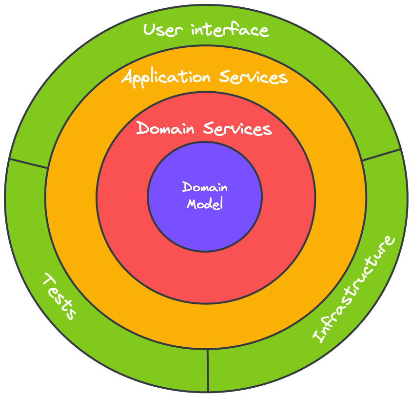

# Onion Architecture

## Contributeurs

S. François

## Statut

Accepté

## Contexte

En parcourant les différents designs architecturaux centrés sur l'isolation de la valeur, je me suis rendu compte que 
nous mélangions la terminologie de plusieurs d'entre eux. De ce fait, il pouvait être difficile pour certains de monter 
sur le projet à cause de confusions sur la terminologie.

## Décision

De ce fait, je vous propose de renommer les dossiers `usecase` par `application-service`, de dissocier `model` et 
`service` dans le dossier `domain` pour bien séparer `domain model` et `domain service` tels qu'expliqués dans l'`Onion 
Architecture`.

## Conséquences

Le design applicatif présent dans ce projet est une implémentation by the book de l'`Onion architecture` et devrait 
permettre un on-boarding plus simple.

## Autres pistes explorées

`Clean architecture` et `architecture hexagonale` auraient toutes deux pu convenir mais il se trouve que notre 
implémentation actuelle se rapprochait beaucoup plus de l'`Onion architecture`.

---

⚓️ [Retour au sommaire](./index.md)
