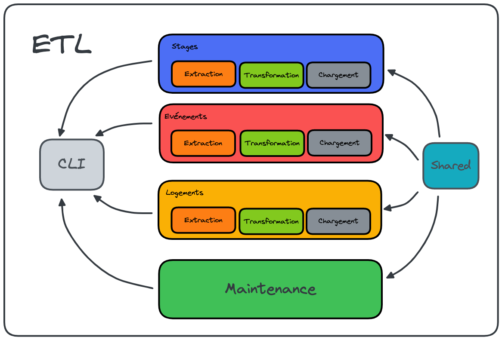

# Architecture de l'ETL

## Introduction

Ce projet a été réalisé en suivant au mieux les principes du [Domain-Driven Design](https://alexsoyes.com/ddd-domain-driven-design/).
C'est pourquoi nous avons identifié des contextes métier indépendants les uns des autres comme représentés ci-dessous :

**Au 10/03/2023 :**



## Point d'entrée

Le point d'entrée de l'application est ici la Command Line Interface (CLI). En effet, l'ETL est aujourd'hui un produit
"serverless" ou "Function as a Service" ([FaaS](https://www.redhat.com/en/topics/cloud-native-apps/what-is-faas)). De ce
 fait, nous exécutons de simples fonctions à intervalles réguliers au travers de la CLI du projet.

Lancer une opération depuis la CLI demande quelques options nécessaires pour savoir quoi lancer :

```shell
$ npm run cli -- [extract|transform|load] [flowName]
```

Pour aller plus loin sur la commande `shell` ci-dessus :
- `npm run cli` nous donne accès à la CLI ;
- `--` nous permet d'ajouter des options supplémentaires à l'action précédente ;
- `[extract|transform|load]` nous permet de choisir quelle action est à réaliser ;
- `[flowName]` nous permet de choisir sur quel flux nous souhaitons réaliser notre action.

## Modules

Comme nous le disions plus haut, nous avons découpé notre application par contexte métier. De ce fait, nous avons
identifiés les 3 modules suivants :
- `evenements`
- `logements`
- `maintenance`
- `stages`

Cela se traduit dans le code par 3 modules distincts totalement isolés les uns des autres.

## Sous-modules

De la même façon que pour les modules, nous avons identifié des sous-modules pour chaque module :
- `chargement`
- `extraction`
- `transformation`

Chaque sous-module suit les principes de l'[Onion Architecture](https://medium.com/expedia-group-tech/onion-architecture-deed8a554423)
et ressemble à l'arborescence suivante :

```markdown
sous-module
├─── application-service
├─── domain
│    ├── model
│    └── service
├─── infrastructure
└─── index.ts
```

---
