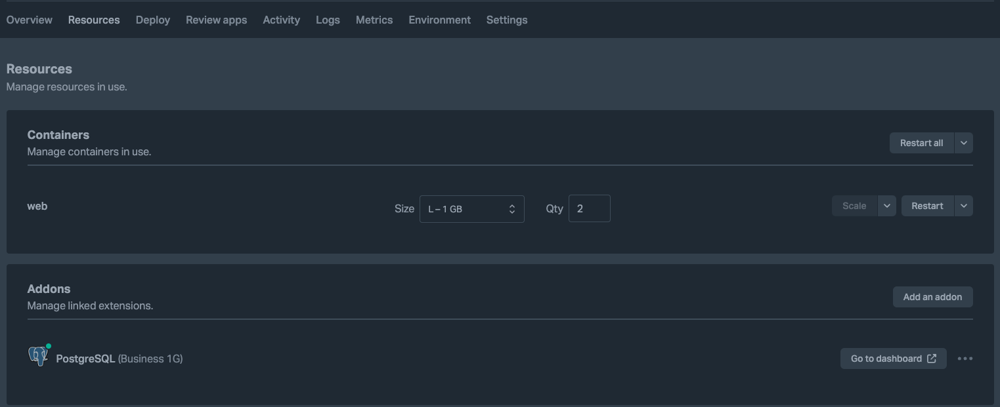
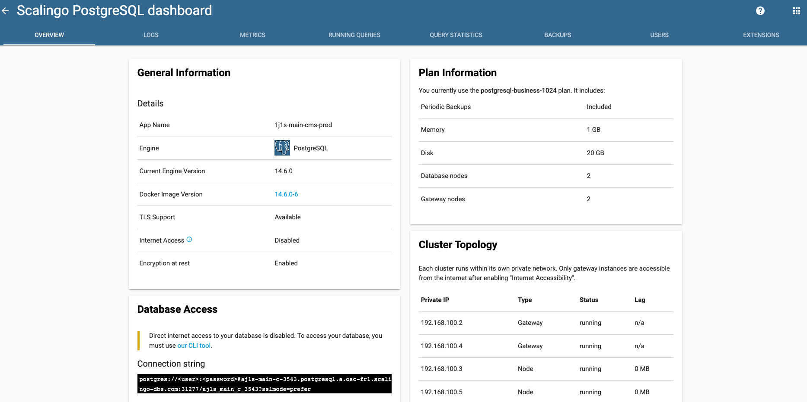
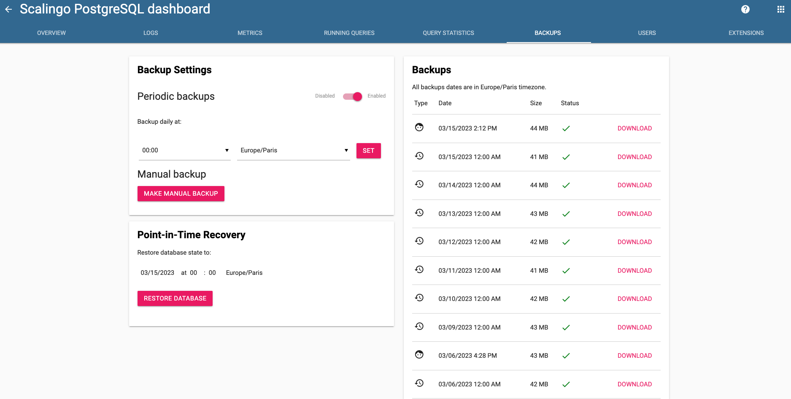

# Rollback de base de données

## Accéder au dashboard de la base de données

Scalingo propose avec ses offres payantes d'automatiser la création de backup d'une base de données périodiquement (et 
c'est déjà fait pour les environnements de production).

Maintenant, vous allez peut-être vouloir créer une back-up manuellement. Pour ce faire, il faut se rendre sur Scalingo, 
là où les ressources d'une application sont détaillées :

Ensuite, cliquez sur le bouton `Go to dashboard` à côté de l'addon correspondant à votre base de données. Cela va ouvrir
 une fenêtre avec le dashboard correspondant à votre base de données.

## Créer une backup de la base de données

*Parce qu'on ne sait jamais !*

Maintenant, vous avez le dashboard ci-dessous devant les yeux :

Rendez vous sur l'onglet `Backups`, en haut à droite :

Pour créer votre backup, il vous suffit maintenant d'appuyer sur le bouton `Make manual backup`. Vous le verrez 
apparaître dans la liste des backups disponibles sur la droite de l'interface. Téléchargez cette sauvegarde via le 
bouton `Download` à l'écran.

## Restaurer la base de données à une date précise

Il vous est maintenant possible de restaurer la base de données à un point donné dans le temps. Choisissez l'heure à 
laquelle vous souhaitez restaurer la base de données puis appuyez sur `Restore database`.

## Restaurer la base de données depuis le dump que vous avez généré

Dans certains cas, vous pourriez être amenés à restaurer la base de données depuis le dump que vous avez généré plus tôt.

Dans ce cas-là, référez-vous directement à la [documentation de Scalingo](https://doc.scalingo.com/databases/postgresql/dump-restore)
 sur le sujet.

**And voilà !**

