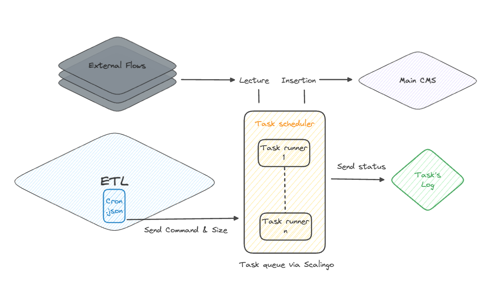
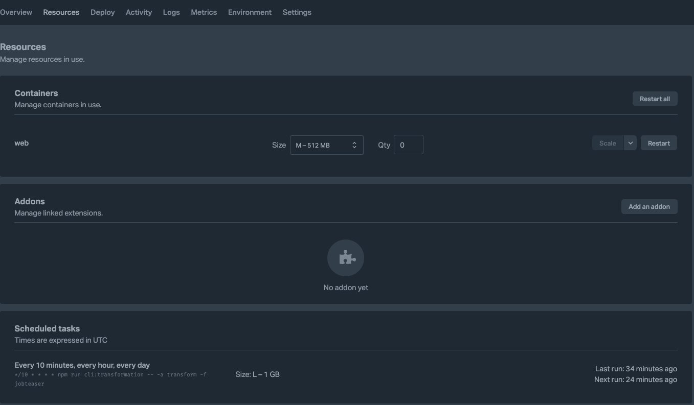

# Utiliser les Scheduled Tasks Scalingo

_20 Avril 2023 (mis à jour le 24 Juillet 2024)_

:::info Contexte
Une scheduled task (ou tâche planifiée) est une opération programmée pour s'exécuter automatiquement à des moments prédéfinis ou selon des intervalles spécifiques. Par exemple transférer les données du CEJ vers vers un serveur externe.
:::


## Démarrage

Pour que Scalingo puisse reconnaître des Scheduled Tasks, il a besoin de trouver un fichier `cron.json` à la racine du
projet à déployer.

Exemple :

```
my-app
├─── build
│    ├── some-fichier.js
│    └── ...
├─── node_modules
│    ├── some-library
│    │   └── some-other-domain-service.ts
│    └── ...
├─── src
│    ├── some-fichier.js
│    └── ...
├─── test
│    ├── some-fichier.test.js
│    └── ...
├─── **cron.json**
├─── package.json
├─── package-lock.json
└─── ...
```

## Déclarer une Scheduled Task

Dans le fichier `cron.json` créé précédemment, ajouter le squelette suivant :

```json
{
  "jobs": []
}
```

Un job est un objet JSON ayant la forme suivante :

```json
{
  "command": "* * * * * npm run ma:tache:programmee",
  "size": "M"
}
```

Penchons-nous sur les attributs et leur contenu :
* `command` est l'attribut dans lequel vous allez renseigner deux informations :
  * Le `cron time`, à savoir la fréquence à laquelle vous souhaitez exécuter le job
  * La commande à lancer, exemple `node start.js`. Il ne tient qu'à vous de définir vos propres commandes
* `size` est l'attribut permettant de spécifier la taille du conteneur dans lequel votre job va tourner sur Scalingo.
Les valeurs possibles sont les suivantes : 
  * `S` pour 256 MB ;
  * `M` pour 512 MB ;
  * `L` pour 1 GB ;
  * `XL` pour 2 GB ;
  * `2XL` pour 4 GB.

Utilisez par défaut la valeur `M` et augmentez si besoin.

### Periode d'inactivité des instances Scalingo

Dans le but d'économiser des ressources, certaines instances de tests sont désactivées pendant la nuit (ex: main-cms).

Comme le fichier `cron.json` ne dépend pas de l'environnement, il faut s'assurer de déclencher les jobs à un moment où les instances nécessaires sont disponibles.

## Pour finir

Déployez votre nouvelle version de votre code sur Scalingo. Si le fichier `cron.json` est correctement renseigné, vous
verrez apparaître vos Scheduled Tasks dans l'onglet `Ressources` sur le panneau `Scheduled Tasks` comme ci-dessous :



## Exemple de fichier `cron.json`

```json
{
    "jobs": [
      {
        "command": "30 7 * * * npm run cli:transformation -- -a transform -f jobteaser",
        "size": "M"
      }, 
      {
        "command": "30 6 * * * npm run cli:transformation -- -a transform -f stagefr",
        "size": "S"
      } 
    ]
}
```
