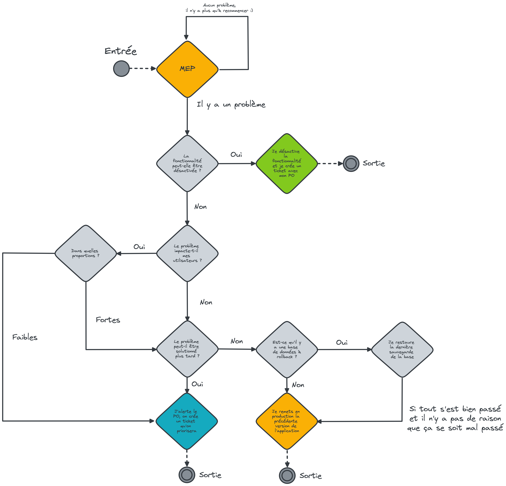

# Que faire si tout se passe mal après une mise en production ?

_20 Avril 2023 (mis à jour le 24 Juillet 2024)_

:::info Contexte
Si demain, vous êtes amenés à faire une mise en production et que d'avance ça devait mal se passer, pas de panique ! 
Ce ne sera qu'une nouvelle mise en production de ratée dans la longue et triste histoire des mises en production ratées.
:::

## Pense-bête

Voici un arbre de décision qui peut vous aider en cas de pépin en production :



## Comment redéployer une ancienne version ?

### Identifier la précédente version déployée

Pour identifier la version actuelle d'une application en production, connectez-vous à l'application Scalingo que vous 
souhaitez redéployer. Regardez ensuite dans l'historique des déploiements. Vous pouvez accéder aux logs de ces derniers 
et parmi ces logs, vous devriez voir le nom du projet déployé ainsi que sa version. Par exemple :

```shell
> 1j1s-etl@4.1.1 prepare
```

On reconnaît bien ici le pattern `projectName@version`. Une fois le numéro de release identifié, il vous suffit de créer
 une branche depuis laquelle redéployer sur Scalingo.

### Créer une branche de release pour Scalingo

Là encore, pas de panique ! C'est à ça que nous sert `release-please` dans la CI. Tout d'abord, sur votre poste, ouvrez 
un terminal et positionnez-vous dans le dépôt que vous souhaitez rollback.

Dans un premier temps, récupérer toutes les branches et tous les tags présents sur le dépôt distant :

```shell
$ git fetch --all --prune
```

Le `--prune` est du bonus pour nettoyer un petit peu votre dépôt Git en local, vous n'êtes pas obligé de le faire.

Une fois fait, il vous suffit de lister les tags du dépôt pour retrouver le numéro de version que vous souhaitez. Pour 
ce faire :

```shell
$ git tag | grep <votre numéro de version>
```

Si le numéro de version se trouve bien dans la liste, vous devriez le voir en retour console. Par exemple :

```shell
# Tag existant pour la version, grep vous renvoie la chaîne que vous avez recherché
$ git tag | grep v4.0.0
v4.0.0
$

# Tag inexistant pour la version, grep ne vous renvoie rien du tout
$ git tag | grep v5.0.0
$
```

Si le tag existe, il va maintenant nous falloir créer la branche depuis ce tag. Positionnez-vous tout d'abord sur le 
commit du tag :

```shell
$ git checkout <votre numéro de version>
```

Exemple :

```shell
$ git checkout v4.0.0
```

Puis, il vous suffit de créer la branche :

```shell
$ git checkout -b release/<votre numéro de version>
```

### Redéployer cette branche sur Scalingo

Retournez maintenant sur Scalingo. Puis, dans l'onglet déploiement, sélectionnez le déploiement manuel qui vous permet 
de choisir la branche à déployer. Sélectionnez celle que vous venez de créer puis déployez-la.

### Rollback la base de données

Vous trouverez les étapes à suivre dans cette [documentation](./rollback-database.md).

**And voilà !**
