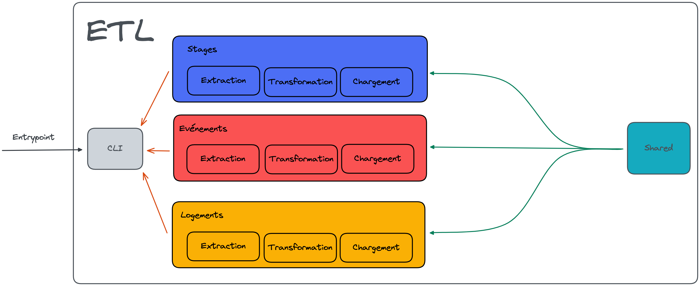

# Architecture du projet

## Sommaire

+ [Introduction]()
+ [Point d'entrée]()
+ [Modules et contextes]()
+ [Sous-Modules et sous-contextes]()
+ [Architecture d'un sous-module]()

## Introduction

Ce projet a été réalisé en suivant au mieux les principes du [Domain-Driven Design](https://alexsoyes.com/ddd-domain-driven-design/).
C'est pourquoi nous avons identifié des contextes et des sous-contextes d'utilisation. La conséquence de ce choix 
est que nous avons modularisé l'application par contexte et sous-contexte d'utilisation.

**Au 30/01/2023 :**



## Point d'entrée

Le point d'entrée de l'application, aussi communément appelée `User Interface` dans l'`Onion Architecture` est ici la 
Command Line Interface (CLI). En effet, l'ETL est aujourd'hui un produit "serverless" ou "Function as a Service" (FaaS). 
De ce fait, nous exécutons de simples fonctions à intervalles réguliers au travers de la CLI du projet.

Lancer une opération depuis la CLI demande quelques options nécessaires pour savoir quoi lancer :

```shell
$ npm run cli -- --domain internships --action extract --flow <insert flow-name>
```

Pour aller plus loin sur la commande `shell` ci-dessus :
- `npm run cli` nous donne accès à la CLI ;
- `--` nous permet d'ajouter des options supplémentaires à l'action précédente ;
- `--domain` nous permet de choisir quel est le contexte d'appel. Ci-dessus par exemple, ce sera le contexte des stages ;
- `--action` nous permet de choisir quelle action exécuter dans le contexte choisi. Ces actions sont aussi aujourd'hui 
nos sous-modules ;
- `--flow` nous permet de choisir sur quel flux nous souhaitons réaliser notre `--action`.

## Modules et contextes

Comme nous le disions plus haut, nous nous sommes appuyés sur les principes du Domain-Driven Design pour découper notre 
application. De ce fait, nous avons identifiés les 3 `bounded-context` (ou "contextes limités" en français) suivants :
- `evenements`
- `logements`
- `stages`

Cela se traduit dans le code par 3 modules distincts qui réunit tout ce qui est lié à chaque contexte. Cela implique 
également que chaque module est isolé des autres.

## Sous-modules et sous-contextes

De la même façon que pour les modules, nous nous sommes appuyés sur les `sub-contexts` de DDD pour identifier nos 
sous-contextes. Cela se traduit dans le code par les sous-modules suivants pour chaque module :
- `chargement`
- `extraction`
- `transformation`

## Architecture d'un sous-module

Chaque sous-module suit les principes de l'[Onion Architecture](https://medium.com/expedia-group-tech/onion-architecture-deed8a554423) 
et ressemble à l'arborescence suivante :

```
sous-module
├─── application-service
├─── configuration
├─── domain
│    ├── model
│    └── service
├─── infrastructure
└─── index.ts
```

---

⚓️ [Retour au sommaire](../index.md)
